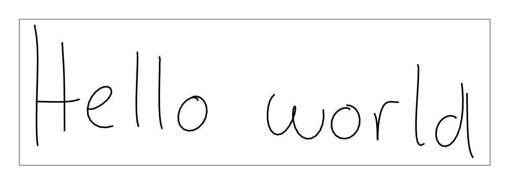
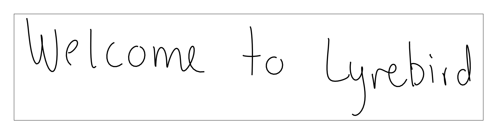
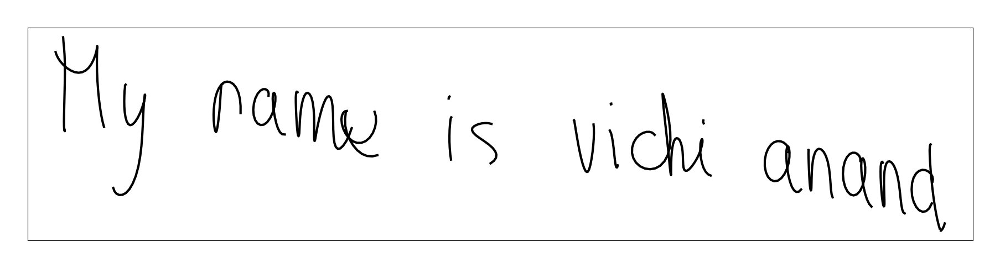
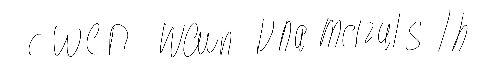
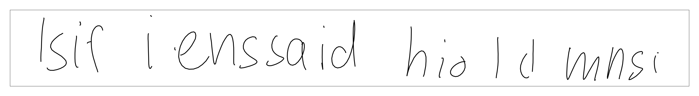

## Handwriting generation using LSTM

Implementing [this paper](https://arxiv.org/pdf/1308.0850.pdf) by Alex Graves using pytorch.

### Training

Use `train.py` script for training the models.

```
$ python train.py -h
usage: train.py [-h] [--uncond] [--batch_size BATCH_SIZE] [--resume RESUME]
                [--logdir LOGDIR] [--n_data N_DATA]

Train a handwriting generation model

optional arguments:
  -h, --help            show this help message and exit
  --uncond              If want to train the unconditional model
  --batch_size BATCH_SIZE
                        Batch size for training
  --resume RESUME       model path from which to resume training
  --logdir LOGDIR       Directory to be used for logging
  --n_data N_DATA       count of strokes to take from data
```


### Generating samples

Use `generate.py` for generating from models using saved state_dict files.

```
$ python generate.py -h
usage: generate.py [-h] [--uncond] --model_path MODEL_PATH
                   [--text TEXT [TEXT ...]] [--sample_length SAMPLE_LENGTH]
                   [--num_sample NUM_SAMPLE] [--seed SEED]

optional arguments:
  -h, --help            show this help message and exit
  --uncond              If want to generate using the unconditional model.
                        Default is conditional
  --model_path MODEL_PATH
                        path to the saved sate_dict file to be used for
                        generating samples
  --text TEXT [TEXT ...]
                        text for which handwriting to be synthesized (for
                        conditional model)
  --sample_length SAMPLE_LENGTH
                        sample length for unconditional model
  --num_sample NUM_SAMPLE
                        number of samples to generate from unconditional model
  --seed SEED
```

Example command for generating from the saved best conditional model:

```bash
python generate.py --model_path data/model_files/handwriting_cond_best.pt --text "Hello world" "Welcome to Lyrebird"
```

Example command for generating from the saved best unconditional model:

```bash
python generate.py --uncond --model_path data/model_files/handwriting_uncond_best.pt --sample_length 600 --num_sample 4
```
## Samples

### Smaples from conditional model

"Hello World"

<br>

"Welcome to Lyrebird"

<br>

"Welcome to Lyrebird"


### Smaples from conditional model

Random sample 1

<br>

Random sample 2

<br>

Random sample 3

<br>

Random sample 4


### Known issues

Implementation of stopping criteria for generation from conditional is not so robust and this may cause model to return empty stroke sequence.
In this case just try with a different seed or with higher bias value and it will work fine.